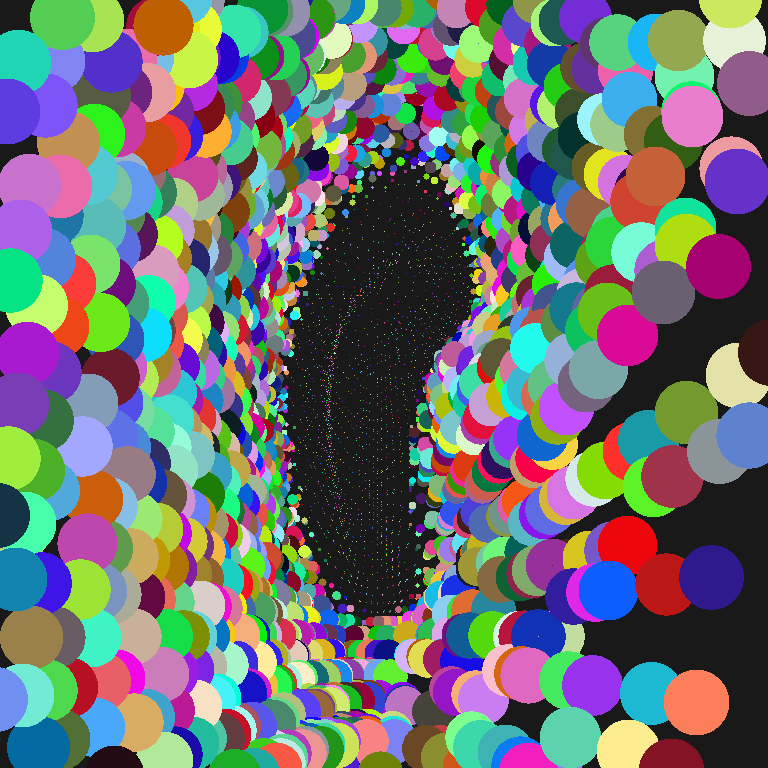

# Nova
 
This is a snapshot of the engine i'm using for my experiments in 3d graphics. It renders geometry in software mode and then blits result into Texture2D and shows it through OpenGL. The goal is to debug everything before shifting to GPU-side.

If you decide to use it, assume that each library it has - can have bugs.



-------

For it to work you need Beef v0.43.3. (https://www.beeflang.org/). Open Beef, goto `File > Open > Open Workspace`, navigage to root folder and hit open. After that you can hit `F5` and it will run. If there are errors, it is very likely, that you opened wrong folder as a workspace.

### Controls
- Use `WASD` for movement;
- Mouse look is toggled by `M` key;
- Pressing `J` will toggle sorting and splatting stages;
- Pressing `P` prints out current transform of the matrix;

### What is happening in this snapshot?

Well, we have a mesh, it's a bunny. Mesh is splitted into clusters, each cluster contains 64 points. During rendering, we generate a set of instructions, each contains information about what should be rendered:
```
	[Union]
	public struct Instruction
	{
		public uint32[3] values;

		public uint32 cameraIndex => this.values[0];
		public uint32 meshIndex => this.values[1];
		public uint32 clusterIndex => this.values[2];
	}
```

When we finished gathering clusters, we send it to software compute shader where each thread is tasked to process specified cluster.

#### Transformation stage
Get matrices of camera and mesh, to which current cluster belongs. Transform each point of the cluster to screen-space and through `atomicMin` save it in the geometry buffer. Each point is now a `Contender`, uint64 that contains depth, index to instruction and index to splat inside that cluster.

#### Sorting stage
Split geometry buffer into 3x3 tiles, copy data to sorting buffer and sort it in such a way, so that nearest to camera contenders will be first in the tile.

#### Splatting stage
Thread is given a pixel coordinates, for which he is tasked to find a winner among contenders. To do this, it will go over neighbouring tiles and search for nearest to the camera contender, compared to the currently selected contender. If it finds one, it will calculate distance from that contender to current pixel coodinates and if the radius of that contender covers current pixel, it will be a temporary winner. Temporary, because there might be other contenders that are closer to the camera and still cover that pixel.

#### Blitting stage
At this point we just copy everything from geometry buffer to the texture and using single quad render that texture on the screen.